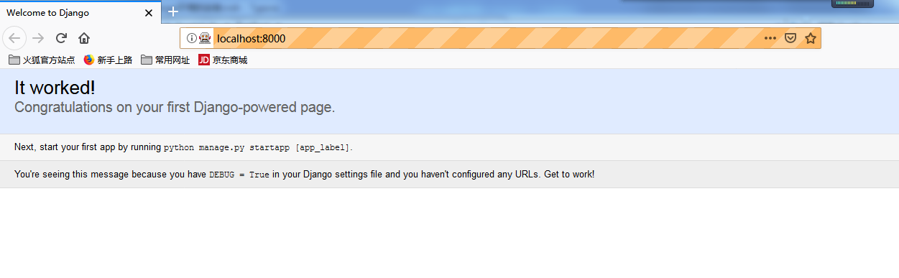

## django+selenium+firefox+geckodriver环境的搭建

### 1. 安装环境的版本

​	python版本要求：3.6

​	django版本：低于1.12

​	selenium版本：低于4.0

​	geckodriver版本：0.24.0	

​	virtualenvwrapper-win版本：1.2.5（**可选择不安装**）

​	Firefox版本：65.0.2 32位

**注意：**python版本是32位的话，其他比如geckodriver和firefox的版本都得是32位，统一一下，不然运行的时候可能打不开Firefox，且程序会报错。

### 2. 安装过程

#### 2.1 安装python3.6

下载地址如下：

https://www.python.org/downloads/release/python-364/

将python的根目录和scripts目录加到Path路径下

```python
C:\Users\Administrator\AppData\Local\Programs\Python\Python36-32\Scripts\;
C:\Users\Administrator\AppData\Local\Programs\Python\Python36-32\;
```

#### 2.2 安装Django和selenium 

使用pip安装Django和selenium

```python
pip install "django<1.12" "selenium<4"
```

#### 2.3 安装虚拟环境Virtualenv

由于直接安装的virtualenv，每次activate和deactivate都需要到固定的位置去，所以使用更为方便的virtualenvwrapper-win管理工具，此工具只在windows下使用

```python
# windows下包装工具安装
pip install virtualenvwrapper-win

# Linux下包装工具安装
pip install virtualenvwrapper
```

#### 2.4 安装Firefox和selenium IDE插件

Firefox下载地址如下：

https://download-ssl.firefox.com.cn/releases-sha2/full/65.0/zh-CN/Firefox-full-latest.exe

安装完成Firefox浏览器后进行如下操作：

附加组件--->查看更多附加组件--->搜索selenium IDE--->添加插件


6. 安装geckodriver驱动

   除了安装selenium IDE，还需要添加火狐的驱动，geckodriver，其下载地址如下：

   https://github.com/mozilla/geckodriver/releases/download/v0.24.0/geckodriver-v0.24.0-win32.zip

   下载完成之后里面是一个exe文件，把文件拷贝到python.exe路径下即可。

### 3. 环境的测试

#### 3.1 测试前准备

* 创建一个项目目录firstTest


* 在此路径下打开命令窗口
* 配置虚拟python环境

```shell
# 创建一个名为superllists虚拟环境，使用默认版本的python
mkvirtualenv superlists
# 若想使用指定版本的python,在Linux下
mkvirtualenv --python=/usr/local/python3.5.3/bin/python superlists
# 在windows下
mkvirtualenv --python=C:\Users\Administrator\AppData\Local\Programs\Python\Python36-32\python.exe superlists
```

* 进入superlists的虚拟环境

```shell
# 查看所有虚拟环境
workon
# 激活superlists虚拟环境
workon superlists
# 取消激活
deactivate
# 删除虚拟环境
rmvirtualenv superlists
```

在这个环境下是复制的python环境中原有的包，在这个环境中任意安装package都不会影响原有python环境。

python，所以在这个环境中没有selenium包。

* 在虚拟环境中安装selenium包

```shell
pip install "selenium<4"
```

到这一步，准备工作就做好了，接下来开始测试。

### 3.2 第一个测试案例

1. 在该目录下创建一个functional_tests.py文件
2. 使用python自带的idle编写如下代码

```python
from selenium import webdriver
browser = webdriver.Firefox()
browser.get('http://localhost:8000')
assert 'Django' in browser.title
```

3. 在项目路径下启动Django服务器

```python
# 开启一个项目
django-admin.py startproject superlists
# 进入django生成的目录
cd superlists
# 启动服务器
python manage.py runserver
```

4. 再次启动一个cmd窗口，进入项目路径，运行python代码

```shell
python functional_tests.py
# 或者使用idle，按F5
```

5. 运行成功，界面如下：




